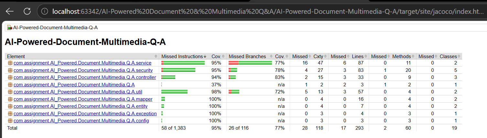

# AI-Powered Document & Multimedia Q&A

An advanced AI platform that allows users to upload documents, audio, and video files to interact with them through AI-powered chat and transcriptions.

## Tech Stack
- **Backend**: Spring Boot 3, Spring Security, MySQL, Spring Data JPA, JaCoCo.
- **Frontend**: React, Vite, TailwindCSS, Lucide-React.
- **AI Integrations**: Deepgram (Transcription), Groq/Deepseek (LLM).
- **Deployment**: Docker, Docker Compose.


## API Documentation

### Authentication
| Method | Endpoint | Description | Auth Required |
|--------|----------|-------------|---------------|
| POST | `/api/auth/signup` | Register a new user | No |
| POST | `/api/auth/login` | Login and receive JWT token | No |

### File Management
| Method | Endpoint | Description | Auth Required |
|--------|----------|-------------|---------------|
| POST | `/api/files/upload` | Upload a new file (PDF/Audio/Video) | Yes |
| GET | `/api/files` | List all files for the current user | Yes |
| DELETE | `/api/files/{id}` | Delete a specific file | Yes |

### AI Chat
| Method | Endpoint | Description | Auth Required |
|--------|----------|-------------|---------------|
| POST | `/api/chat` | Ask questions about a specific file | Yes |

---

## Interactive Documentation (Swagger)
If the backend is running, you can access the interactive Swagger UI at:
[http://localhost:8080/swagger-ui.html](http://localhost:8080/swagger-ui.html)

---

## Live Demo
[View Live Demo](https://ai-powered-doc-multimedia-qa.netlify.app/) (Placeholder)

---

## Getting Started

### Prerequisites
- **Java 21**
- **Node.js 20+** and **pnpm**
- **Docker & Docker Desktop**

### Setup & Running

#### Option 1: Docker (Recommended)
1. Clone the repository.
2. Run from the root:
   ```bash
   docker-compose up --build
   ```
3. Access **Frontend** at `http://localhost` and **Backend** at `http://localhost:8080`.

#### Option 2: Local Development
**Backend:**
1. Update `backend/src/main/resources/application.properties` with your MySQL credentials.
2. Run: `./mvnw spring-boot:run`

**Frontend:**
1. Run: `pnpm install` then `pnpm dev` inside the `frontend` folder.

---

## Testing & Quality
Run backend tests to verify stability and coverage:
```bash
./mvnw clean test
```

### Code Coverage
The project maintains a high coverage standard (**95% Instructions**).


*(Run `./mvnw clean test` to update the report locally)*

After running tests, the interactive report can be viewed at:
`backend/target/site/jacoco/index.html`
